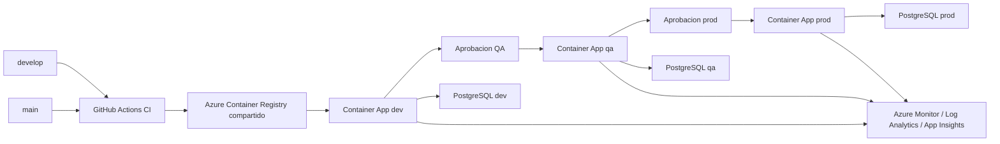

# Arquitectura Azure - Cero Huella IA

## Objetivo

Definir la arquitectura inicial para desplegar Cero Huella IA con GitHub Actions, Terraform y Azure. Esta fase fija decisiones de nombres, ambientes, recursos compartidos, recursos por ambiente, seguridad, observabilidad y cumplimiento OECE antes de construir los modulos Terraform.

## Alcance

La arquitectura cubre tres ambientes:

- `dev`: integracion continua y pruebas tecnicas.
- `qa`: validacion previa con aprobacion manual.
- `prod`: ambiente estable con aprobacion manual.

GitHub sera el unico motor CI/CD activo. Azure DevOps y AWS quedan como referencia historica de implementaciones previas.

## Flujo objetivo

## Convencion de nombres

Usar nombres predecibles, cortos y con ambiente al final. Para recursos que exigen unicidad global o restricciones de caracteres, usar sufijos compactos.

| Recurso | Patron |
| --- | --- |
| Resource group compartido | `rg-cerohuella-shared` |
| Resource group ambiente | `rg-cerohuella-{env}` |
| ACR compartido | `acrcerohuellashared` |
| Container Apps Environment | `cae-cerohuella-{env}` |
| Container App API | `ca-cerohuella-api-{env}` |
| PostgreSQL Flexible Server | `psql-cerohuella-{env}` |
| Base de datos | `cerohuella` |
| Log Analytics Workspace | `law-cerohuella-{env}` |
| Application Insights | `appi-cerohuella-{env}` |
| Managed Identity Container App | `id-cerohuella-api-{env}` |
| VNet | `vnet-cerohuella-{env}` |
| Subnet Container Apps | `snet-containerapps-{env}` |
| Subnet PostgreSQL | `snet-postgresql-{env}` |
| Private DNS PostgreSQL | `pdz-cerohuella-{env}.postgres.database.azure.com` |

`{env}` puede ser `dev`, `qa` o `prod`.

## Region

Region principal propuesta: `eastus`.

Motivos:

- El despliegue actual de Azure Container Apps ya usa `eastus`.
- Mantiene runtime, red, observabilidad y PostgreSQL en una sola region para simplificar red privada.
- Facilita el uso de una VNet por ambiente con Container Apps y PostgreSQL en el mismo alcance regional.

Decision pendiente solo si aparece una restriccion de latencia o disponibilidad: evaluar `brazilsouth` como alternativa para usuarios en Peru. Para esta etapa se prioriza simplicidad operativa.

## Grupos de recursos

Usar un grupo compartido y un grupo por ambiente:

- `rg-cerohuella-shared`: ACR, backend Terraform si se decide alojarlo aqui, identidades compartidas si aplica.
- `rg-cerohuella-dev`: runtime, red, PostgreSQL y observabilidad de `dev`.
- `rg-cerohuella-qa`: runtime, red, PostgreSQL y observabilidad de `qa`.
- `rg-cerohuella-prod`: runtime, red, PostgreSQL y observabilidad de `prod`.

Esta separacion permite aislar costos, permisos, limpieza y cambios por ambiente sin duplicar el registry de imagenes.

## Azure Container Registry

Estrategia: ACR compartido.

Nombre propuesto: `acrcerohuellashared`.

Razon:

- El pipeline construye una sola imagen por commit.
- La misma imagen, preferentemente por digest o tag inmutable basado en SHA, se promueve de `dev` a `qa` y luego a `prod`.
- Reduce costo y evita duplicar imagenes entre ambientes.

Acceso:

- GitHub Actions publica imagenes en ACR usando OIDC hacia Azure.
- Cada Container App usa managed identity con permiso `AcrPull`.
- No usar usuario administrador de ACR ni password de registry.

## Compute y runtime

Servicio objetivo: Azure Container Apps.

Cada ambiente tendra:

- Un Container Apps Environment.
- Una Container App para la API FastAPI.
- Ingress externo HTTPS para exponer `/health`, `/docs` y endpoints de API.
- Min replicas inicial: `0` para `dev` y `qa`; `1` para `prod` si el costo lo permite.
- Max replicas inicial: `1` o `2` segun ambiente.
- CPU/memoria inicial: `0.5 vCPU / 1Gi` para `dev` y `qa`; `1 vCPU / 2Gi` para `prod` si las pruebas de PDF lo requieren.

El almacenamiento de PDFs se mantiene en disco local por decision de esta etapa. Riesgo aceptado: los archivos se pierden ante recreacion, reinicio o cambio de replica. Este riesgo debe quedar documentado hasta migrar a Azure Files o Blob Storage.

## PostgreSQL

Estrategia: PostgreSQL Flexible Server por ambiente.

Razon:

- Evita que pruebas de `dev` o `qa` afecten datos de `prod`.
- Permite aplicar migraciones y pruebas con menor riesgo.
- Facilita politicas de backup, firewall y limpieza por ambiente.

Configuracion inicial:

- `psql-cerohuella-dev`
- `psql-cerohuella-qa`
- `psql-cerohuella-prod`
- Base de datos: `cerohuella`.
- SKU inicial de bajo costo para todos los ambientes, ajustable por Terraform.

Red:

- Preferir acceso privado por VNet.
- Usar una subnet delegada exclusiva para PostgreSQL por ambiente.
- Crear Private DNS Zone compatible con PostgreSQL Flexible Server.
- El Container Apps Environment debe estar integrado a la VNet del ambiente para conectar con PostgreSQL sin abrir acceso publico.

## Red

Cada ambiente tendra una VNet propia:

- `vnet-cerohuella-dev`
- `vnet-cerohuella-qa`
- `vnet-cerohuella-prod`

Subnets minimas:

- `snet-containerapps-{env}` para Container Apps Environment.
- `snet-postgresql-{env}` delegada a PostgreSQL Flexible Server.

El ingreso HTTP de la API sera publico por Azure Container Apps con HTTPS administrado. La base de datos no debe exponerse publicamente salvo excepcion temporal documentada.

## Secretos

Estrategia:

- GitHub Environments para secretos de pipeline por ambiente.
- Container App secrets para secretos consumidos por la aplicacion.
- Terraform para estructura y referencias, evitando incluir secretos de aplicacion cuando sea posible.

Secretos esperados por ambiente:

- `GOOGLE_CLOUD_PROJECT_ID`
- `GOOGLE_APPLICATION_CREDENTIALS_B64`
- `POSTGRES_ADMIN_PASSWORD`
- `DATABASE_URL` si no se compone en el workflow.
- `AZURE_CLIENT_ID`
- `AZURE_TENANT_ID`
- `AZURE_SUBSCRIPTION_ID`

Criterios:

- Usar OIDC para GitHub Actions y evitar secretos largos de Azure.
- No guardar JSON crudo de Google Cloud como secreto. Mantener `GOOGLE_APPLICATION_CREDENTIALS_B64`.
- No imprimir secretos en logs.
- Tratar el backend Terraform como sensible porque puede contener valores marcados `sensitive`.

## Observabilidad basica

Servicios iniciales:

- Azure Monitor.
- Log Analytics Workspace por ambiente.
- Application Insights por ambiente.

Alcance:

- Logs de Container Apps hacia Log Analytics.
- Telemetria de FastAPI via Azure Monitor OpenTelemetry.
- Requests, dependencias, excepciones y trazas en Application Insights.
- Alertas basicas por salud, errores, latencia, reinicios y PostgreSQL.

No se desplegara Prometheus, Grafana, Loki ni Jaeger en esta etapa. El proyecto final local de observabilidad queda como referencia conceptual para golden signals, logs estructurados, trazas y alertas.

## Tags obligatorios

Aplicar estos tags a todos los recursos Terraform:

| Tag | Valor esperado |
| --- | --- |
| `project` | `cerohuella-ia` |
| `environment` | `dev`, `qa`, `prod` o `shared` |
| `managedBy` | `terraform` |
| `repository` | `compania-pari/CEROHUELLA_IA` |
| `owner` | `lpari` |
| `costCenter` | `dmc` |
| `workload` | `api-redaccion-pdf` |

## Ramas y promocion

Decision inicial:

- `develop`: rama de integracion. Despliegue automatico a `dev`.
- `main`: rama estable. Desde aqui se promueve con aprobaciones a `qa` y `prod`.

Promocion:

1. Pull request hacia `develop`: CI obligatorio.
2. Merge a `develop`: build, push de imagen y deploy a `dev`.
3. Pull request de `develop` hacia `main`: CI obligatorio.
4. Merge a `main`: deploy/promocion a `qa` con aprobacion.
5. Aprobacion manual: promocion a `prod`.

## Excepcion OECE sustentada

El protocolo institucional base favorece Java/Spring Boot, Angular/TypeScript y Oracle. Cero Huella IA se sustenta como excepcion tecnica por:

- Uso de Python/FastAPI por integracion directa con librerias de IA, procesamiento PDF y Google Cloud DLP.
- Uso de PostgreSQL por compatibilidad ya implementada con SQLAlchemy, Alembic y despliegues previos.
- Uso de Azure Container Apps por empaquetado Docker y despliegue administrado.
- Uso de servicios cloud de observabilidad por trazabilidad operativa y reduccion de carga administrativa.

Controles compensatorios:

- Contratos REST documentados via OpenAPI.
- Migraciones versionadas con Alembic.
- CI con pruebas automatizadas.
- Infraestructura versionada con Terraform.
- Secretos fuera del repositorio.
- Logs, trazas y alertas con Azure Monitor/Application Insights.
- Separacion por ambientes `dev`, `qa` y `prod`.

## Referencias oficiales revisadas

- Azure Container Apps Environment en Terraform: https://registry.terraform.io/providers/hashicorp/azurerm/latest/docs/resources/container_app_environment
- Managed identity para Azure Container Registry: https://learn.microsoft.com/en-us/azure/container-registry/container-registry-authentication-managed-identity
- PostgreSQL Flexible Server con acceso privado: https://learn.microsoft.com/en-us/azure/postgresql/network/concepts-networking-private
- Azure Monitor OpenTelemetry para Python: https://learn.microsoft.com/en-us/python/api/overview/azure/monitor-opentelemetry-readme
- OpenTelemetry en Application Insights: https://learn.microsoft.com/en-us/azure/azure-monitor/app/opentelemetry-enable

